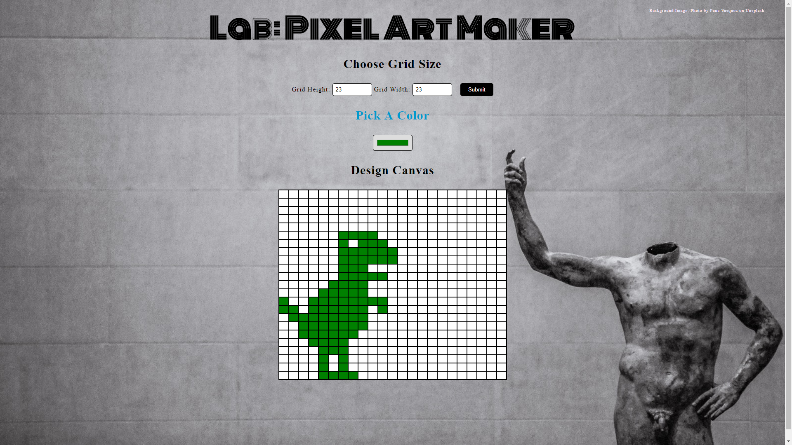

# Lab-Pixel-Art-Maker

For Udacity fewd-fend-challenge

[Heres a link to the Udacity repo](https://github.com/udacity/project-pixel-art-maker-starter)

## The user should be able to:

* Dynamically set the size of the table as an N by M grid
* Choose a colour
* Click a cell in the grid to fill that cell with the choosen color

Primary task is to implement the makeGrid() fucntion, that dynamically creates a grid that the user can interact with.

### Link to finished project

[Pixel Art Maker](https://foxystoat.github.io/Lab-Pixel-Art-Maker/)

### Screenshot of Finished Game

 

